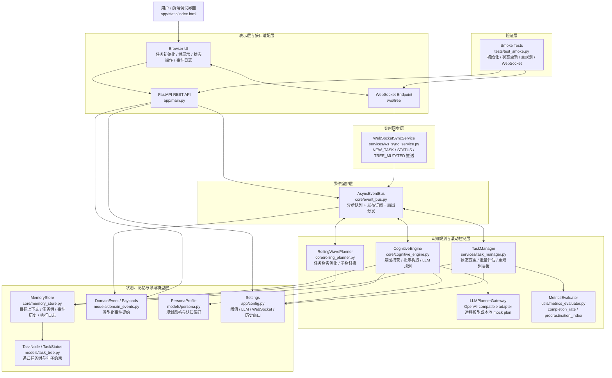
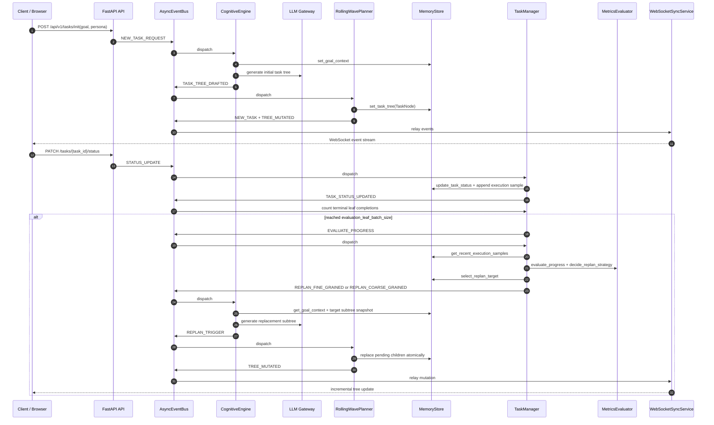

# SYA Task Scheduler Code Architecture

本文档基于当前代码库整理，用于以偏学术化的方式描述 `sya_task_scheduler` 的代码结构与运行机理。系统可以抽象为一个面向高自由度任务的事件驱动闭环规划原型：外部意图经接口层进入系统，由认知规划模块生成层次化任务树，再由执行反馈与效能评估触发滚动式重规划。

## 1. Layered Architecture



## 2. Event-Driven Closed Loop



## 3. Module Semantics

| 模块 | 主要职责 | 架构角色 |
| --- | --- | --- |
| `app/main.py` | 构建依赖容器、注册生命周期、暴露 REST 与 WebSocket 入口 | 系统入口与接口适配 |
| `core/event_bus.py` | 维护异步事件队列与发布订阅分发 | 领域事件编排中心 |
| `core/cognitive_engine.py` | 解析用户意图、装配 persona/context、调用 LLM 或 mock 规划器 | 认知规划与重规划生成器 |
| `core/rolling_planner.py` | 将 LLM JSON 校验为 `TaskNode`，执行初始建树与 pending 子树替换 | 滚动波规划执行器 |
| `core/memory_store.py` | 在锁保护下保存目标上下文、任务树、事件历史与执行样本 | 运行时状态与记忆基底 |
| `services/task_manager.py` | 处理状态变更、统计终止叶子节点、触发效能评估与重规划事件 | 执行反馈控制器 |
| `services/ws_sync_service.py` | 将关键领域事件广播给前端，并支持节点级 scope 过滤 | 增量同步适配器 |
| `models/domain_events.py` | 定义事件枚举、重规划策略与各类 payload schema | 事件契约层 |
| `models/task_tree.py` | 定义递归任务节点、状态集合、叶子约束与子树合并规则 | 领域对象层 |
| `utils/metrics_evaluator.py` | 计算短窗口完成率与拖延指数，并选择 fine/coarse/none 策略 | 效能度量与策略函数 |

## 4. Architectural Interpretation

该系统的核心不是传统请求-响应式任务管理，而是一个基于事件流的自适应规划闭环。`TaskNode` 构成层次化计划空间，`MemoryStore` 保存当前计划状态与执行痕迹，`TaskManager` 将用户状态更新转化为短窗口效能指标，`CognitiveEngine` 则将指标、persona 与目标上下文重新编码为规划提示。最终，`RollingWavePlanner` 只替换目标节点下仍处于 pending 的子任务，从而在保留已完成执行历史的同时调整未来工作粒度。

从研究原型角度看，这一架构可以表述为：

```text
Intent I + Persona P
    -> Cognitive Decomposition D_0
    -> Hierarchical Task Tree T
    -> Execution Observations O_t
    -> Efficacy Metrics M_t
    -> Granularity Policy pi(M_t)
    -> Rolling Subtree Replacement T_{t+1}
```

其中，`completion_rate` 用于衡量近期完成效率，`procrastination_index` 用于刻画实际耗时相对估计耗时的正向偏差；当完成率低于低阈值时，系统倾向于细粒度重规划，当完成率高于高阈值时，系统倾向于粗粒度合并。

